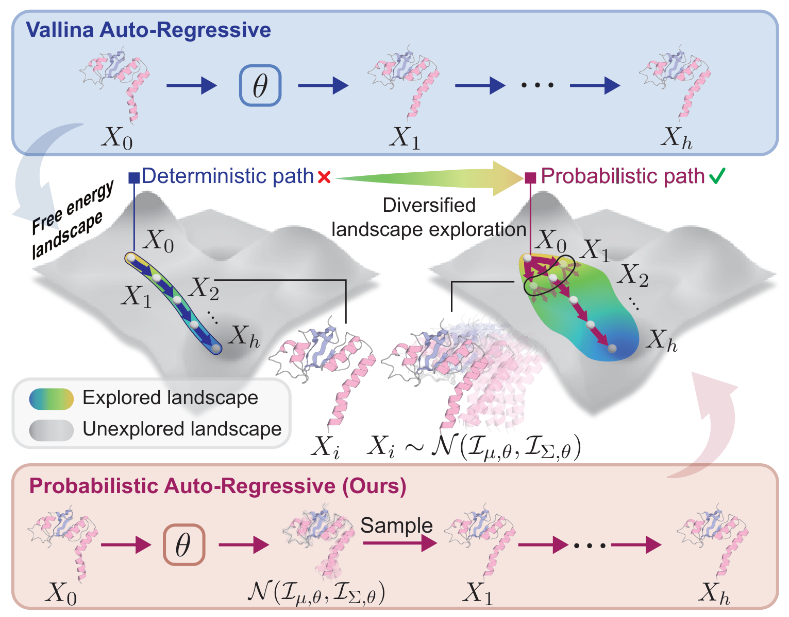

<div align="center">

# ProAR: Probabilistic Autoregressive Modeling for Molecular Dynamics

</div>

**ProAR** is a probabilistic autoregressive framework for generating protein molecular dynamics (MD) trajectories. Given an initial protein structure, ProAR autoregressively generates a sequence of future conformations of arbitrary length, enabling fast and accurate MD trajectory forecasting.

This repository provides **inference code** for the [ATLAS](https://www.dsimb.inserm.fr/ATLAS) protein dataset.

[[Paper (AAAI 2026)]](https://ojs.aaai.org/index.php/AAAI/article/view/36974) | [[Preprint (bioRxiv)]](https://www.biorxiv.org/content/10.64898/2026.03.20.713063v1)

## Overview

<p align="center">
  
</p>

Understanding the structural dynamics of biomolecules is crucial for uncovering biological functions. While molecular dynamics (MD) simulations provide detailed atomic-level trajectories, they remain computationally expensive and temporally limited. Existing deep generative approaches for trajectory synthesis jointly denoise high-dimensional spatiotemporal representations, conflicting with MD's sequential frame-by-frame integration and failing to capture time-dependent conformational diversity.

Inspired by the sequential nature of MD simulation, ProAR introduces a **probabilistic autoregressive** paradigm with the following key ideas:

- **Dual-network system.** A stochastic, time-conditioned *interpolator* predicts intermediate protein conformations as structured multivariate Gaussian distributions (estimating both mean and covariance), while a *forecaster* infers future structures through a corruption-refinement process conditioned on past observations.

- **Probabilistic frame modeling.** Each predicted frame is modeled as a multivariate Gaussian over residue-level rigid-body transformations, capturing conformational uncertainty and enabling diverse sampling of the free energy landscape -- unlike deterministic autoregressive methods that produce only a single trajectory path.

- **Anti-drifting sampling.** During inference, the interpolator and forecaster alternate in a sampling loop: the forecaster extrapolates forward, the interpolator fills in intermediate frames, and the forecaster refines its prediction with increasingly close context. This strategy mitigates cumulative error over long autoregressive rollouts.

On the ATLAS dataset, ProAR achieves a **7.5% reduction** in reconstruction RMSE and an average **25.8% improvement** in conformation change accuracy compared to previous state-of-the-art trajectory generation methods. For conformation sampling, it performs comparably to specialized time-independent models, providing a flexible and dependable alternative to standard MD simulations.

## Installation

### Prerequisites

- Python >= 3.9
- CUDA-enabled GPU

Our experiments were conducted with **PyTorch 2.6.0 + CUDA 12.4**. We recommend installing the CUDA-specific packages first:

```bash
# 1. Install PyTorch with CUDA support
pip install torch==2.6.0 torchvision==0.21.0 torchaudio==2.6.0 --index-url https://download.pytorch.org/whl/cu124

# 2. Install torch_scatter (should match your PyTorch + CUDA version)
pip install torch_scatter -f https://data.pyg.org/whl/torch-2.6.0+cu124.html

# 3. Install OpenMM with CUDA support
pip install openmm[cuda12]
```

> For other PyTorch/CUDA versions, see [PyTorch Get Started](https://pytorch.org/get-started/locally/) and adjust the URLs above accordingly.

### Install ProAR

```bash
git clone https://github.com/kaiwencheng7/ProAR.git
cd ProAR
pip install -r requirements.txt
```

## Data Preparation

ProAR expects a simple directory-based input format. Each protein is a subdirectory containing three files:

```
your_data_dir/
├── protein_A/
│   ├── init.pdb            # Initial frame PDB file
│   ├── esm_seq.npy         # (num_res, 1280) ESM sequence representation
│   └── esm_pair.npy        # (num_res, num_res, 20) ESM pair representation
├── protein_B/
│   ├── init.pdb
│   ├── esm_seq.npy
│   └── esm_pair.npy
└── ...
```

### Atlas Test Set (Quick Start)

We provide scripts to download the 82-protein Atlas test set and generate ESM-2 features:

```bash
# Step 1: Download Atlas test set PDB files
bash scripts/download_atlas_test.sh ./data/atlas_test

# Step 2: Generate ESM-2 features
python scripts/preprocess_esm.py --data_dir ./data/atlas_test --device cuda
```

After these two steps, `./data/atlas_test/` is ready for inference.

### Custom Proteins

For your own proteins, place each `init.pdb` in a separate subdirectory under `data_dir`, then run the ESM preprocessing:

```bash
python scripts/preprocess_esm.py --data_dir /path/to/your/data --device cuda
```

The script automatically skips proteins that already have ESM features.

## Running Inference

### Quick Start

Model checkpoints are automatically downloaded from HuggingFace Hub on first run:

```bash
python run.py \
    experiment=atlas \
    datamodule.data_dir=/path/to/your/data \
    module.autoregressive_steps=42 \
    diffusion.sampling_type=naive \
    diffusion.refine_intermediate_predictions=True
```

### Using Local Checkpoints

If you have local checkpoint files:

```bash
python run.py \
    experiment=atlas \
    datamodule.data_dir=/path/to/your/data \
    ckpt_path=/path/to/forecaster.ckpt \
    diffusion.interpolator_local_checkpoint_path=/path/to/interpolator.ckpt \
    diffusion.hydra_local_config_path=/path/to/interpolator_config.yaml \
    module.autoregressive_steps=42 \
    diffusion.sampling_type=naive \
    diffusion.refine_intermediate_predictions=True
```

### Using the Inference Script

```bash
# Edit scripts/run_inference.sh to set your data directory, then:
bash scripts/run_inference.sh
```

### Key Parameters

| Parameter | Description | Default |
|-----------|-------------|---------|
| `datamodule.data_dir` | Path to data directory | Required |
| `module.autoregressive_steps` | Number of autoregressive rollout steps | 42 |
| `diffusion.sampling_type` | Sampling algorithm: `naive` or `cold` | `cold` |
| `diffusion.refine_intermediate_predictions` | Refine predictions with interpolator | `False` |
| `datamodule.horizon` | Prediction horizon per step | 6 |


## Project Structure

```
ProAR/
├── run.py                          # Entry point
├── splits/
│   └── atlas_test.csv              # Atlas test set protein list (82 proteins)
├── scripts/
│   ├── download_atlas_test.sh      # Download Atlas test set PDB files
│   ├── preprocess_esm.py           # Generate ESM-2 features
│   └── run_inference.sh            # Run inference
├── src/
│   ├── train.py                    # Inference orchestration
│   ├── interface.py                # Model/data instantiation
│   ├── configs/                    # Hydra configuration files
│   ├── datamodules/                # Atlas dataset loading
│   ├── diffusion/                  # ProAR diffusion sampling logic
│   ├── experiment_types/           # Lightning module wrappers
│   ├── models/                     # Neural network architectures
│   │   ├── esmfold.py              # Interpolator (ESMFold-based)
│   │   ├── p2dflow.py              # Forecaster (P2DFlow-based)
│   │   ├── trunk.py                # Folding trunk with IPA
│   │   └── modules/                # IPA, EGNN, backbone layers
│   └── utilities/                  # Helpers, metrics, HF Hub
└── chroma/                         # Protein structure utilities (vendored)
```

## Acknowledgments

This project builds upon:

- **[DYffusion](https://github.com/Rose-STL-Lab/dyffusion)** (Cachay et al., NeurIPS 2023): The dynamics-informed diffusion framework that ProAR adapts for autoregressive trajectory generation.
- **[P2DFlow](https://github.com/bleach366/p2dflow)** (Jin et al., JCTC 2025): SE(3) flow matching model for protein ensembles, used as the basis of the forecaster.
- **[Chroma](https://github.com/generatebio/chroma)** (Ingraham et al., Nature 2023): ProAR adopts the Rg-confined globular covariance model proposed in Chroma as a prior for the learnable covariance in the interpolator.

## Citation

If you find this code useful, please cite our paper:

```bibtex
@article{Cheng_Liu_Nie_Lin_Hou_Tao_Liu_Chen_Mao_Tian_2026,
  title={ProAR: Probabilistic Autoregressive Modeling for Molecular Dynamics},
  volume={40},
  url={https://ojs.aaai.org/index.php/AAAI/article/view/36974},
  DOI={10.1609/aaai.v40i1.36974},
  number={1},
  journal={Proceedings of the AAAI Conference on Artificial Intelligence},
  author={Cheng, Kaiwen and Liu, Yutian and Nie, Zhiwei and Lin, Mujie and Hou, Yanzhen and Tao, Yiheng and Liu, Chang and Chen, Jie and Mao, Youdong and Tian, Yonghong},
  year={2026},
  month={Mar.},
  pages={147-155}
}
```
